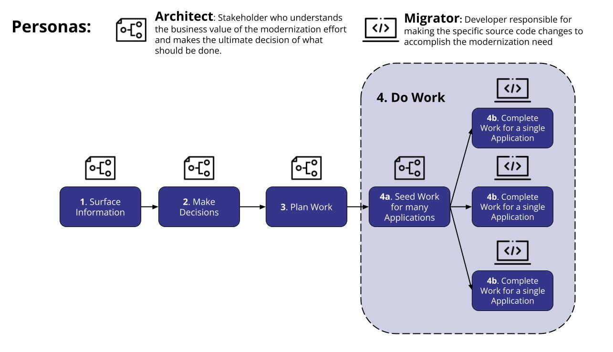
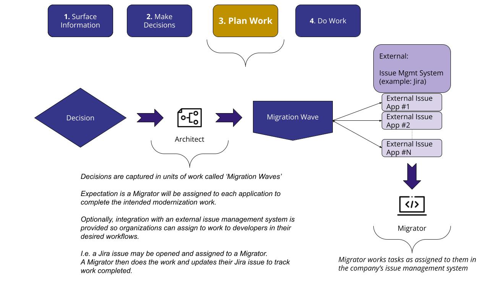

# Konveyor Unified Experience
Konveyor will provide a unified experience of tools to help organizations modernize their applications at scale,
optionally allowing adoption of the open [konveyor/methodology](https://github.com/konveyor/methodology) to provide a
form of 'guide rails' for the modernization journey.

## Konveyor Community Mission
Konveyor's mission is to establish:
> A community of people passionate about helping others modernize and migrate their applications to the hybrid cloud by
> building tools and best practices on how to replatform and refactor applications to run on Kubernetes and
> cloud-native technologies

The community is focused on building:
> The ultimate Open Source toolkit to help organizations safely migrate and modernize their application portfolio to
> leverage Kubernetes, providing differential value on each stage of the adoption process

## Konveyor Methodology
An open [methodology](https://github.com/konveyor/methodology) for migrating and modernizing applications to leverage
Kubernetes has been contributed, providing suggestions for how to use the projects within the
[Konveyor](www.konveyor.io) community to accelerate the process where applicable.

[Image Source](https://docs.google.com/drawings/d/1zHTILKacmiP6fHKyqQPHLVsDyHnyiB7sMGQ4clsKzks/edit)

1. [Assess](https://github.com/konveyor/methodology#assess) - Engagement in which an exhaustive analysis of the current situation is made, including infrastructure and applications, technologies used and dependencies. Not only is it technical, it also affects processes and application lifecycle management. Next, a definition of the TO-BE scenario is proposed to implement the new platform, clearly identifying gaps and defining the next steps to following. In addition, an initial estimate of the complete migration process is offered. This first estimate does not have great precision, but it does serve to give an idea of ​​orders of magnitude.

2. [Rationalize](https://github.com/konveyor/methodology#rationalize) - Based on the outputs obtained during the Assess phase, the most suitable migration strategy for each application type is decided during the Rationalize phase. These strategies are based on the now standard [6 Rs approach](https://aws.amazon.com/blogs/enterprise-strategy/6-strategies-for-migrating-applications-to-the-cloud/) that Amazon popularized a few years ago.

3. [Prepare](https://github.com/konveyor/methodology#prepare) - This phase focuses on ensuring everything is ready to start deploying applications on the target platform and on conducting technical feasibility tests for migration. Its main mission is to solve the technical challenges encountered during the assessment and mitigate the risks associated with them, while initializing the common knowledge base with the findings that are being made.

4. [Pilot](https://github.com/konveyor/methodology#pilot) - After solving the main technical problems in the Prove phase, a complete migration of a representative set of applications to the new environment is executed, thoroughly documenting the process, focusing on making it repeatable.

5. [Scale](https://github.com/konveyor/methodology#scale) - Using the information collected in the previous points it is possible to offer a much more accurate estimate of the following steps. In addition, the definitive implementation strategy is defined with its associated project plan, including the design of the different teams to be involved in the migration and the management and communication model between them. Once everything is set, execution of the migration plan can be carried out, starting the “factory mode” in which applications are migrated in parallel by various teams in typically two-week sprints.

This [methodology](https://github.com/konveyor/methodology) is the result of several years of working with many large
organizations, distilling the best practices for navigating and orchestrating modernization efforts safely at scale.

See [github.com/konveyor/methodology](https://github.com/konveyor/methodology) for more info.

# Unified Experience Overview
The unified experience will be centered on surfacing information to a user so they may make informed business value
decisions in regard to application modernization.

The unified experience aims to be developed in a technology-agnostic manner, meaning Konveyor will codify discrete steps
to build a workflow for any modernization journey, relying on additional components to provide the technology specific 
details.  The aim being that this solution will be able to evolve in time as technology needs change beyond the initial 
goal of enabling legacy applications to be modernized to Kubernetes.

_Note: Konveyor will integrate and provide tools that will aid specific modernization use-cases, yet it is _not_
intended to become an 'easy button' that will 'automagically' refactor an application for a given technology. That is 
considered out of scope for the project._

## Workflow

[Image Source](https://docs.google.com/drawings/d/1vHOKHUj7cSqawof9PQqb8zpsYyPCR3WL-Pz4GIBiYzE/edit)

1. **Surface Information**: Gather information about applications (static code analysis & assessments) to a Decision Maker, storing information
in an *Application Inventory* provided by a *Hub*.
2. **Make Decisions**:  Aid a Decision Maker to make informed decisions about their modernization/migration needs.
3. **Plan Work**: Help a Decision Maker plan work via 'Migration Waves'.
4. **Do Work**: Help developers complete the needed migration and modernization work by providing assets and guidance through a
catalog of integrated tools to aid specific workflows.

While the workflow associated with the Unified Experience provides differential value on each one of the stages of the Konveyor migration methodology, the intent is to make it generic enough so it can be leveraged on different migration and modernization methodologies that organizations, GSIs and vendors might be used to follow. Konveyor won't be built to enforce a given methodology, but to **provide insights, guidance, assets and some degree of automation that can be leveraged on large scale migration projects**. The ultimate goal of Konveyor is to enable organizations to reduce the risk associated with large modernization initiatives by making the associated projects measurable and predictable.

## Personas
Two initial personas are identified, with more to be added in the future.

[Image Source](https://docs.google.com/drawings/d/1ASbIjFKfQc88ZeL-Dm7RsfTNkxystsmgmZagrqk8q6o/edit)

### Architect

A decision maker leading the modernization/migration initiative, who will review information Konveyor surfaces about an application's suitability for a given platform or runtime technology and ultimately make decisions of planning work for a **Migrator** to complete.
* Surfaced information will be used to help this user make informed decisions, plan, and begin to execute
modernization work.
* Architects are expected to be knowledgeable individuals that understand the business value an application provides and are capable
of weighing technical costs versus expected business value to decide on the best course for modernization need.
* Optionally, they will seed development work for 'Migrators' to handle identified issues
* Primary expected user of Konveyor's unified experience.

### Migrator

A developer assigned to handle the source code updates and development efforts to satisfy issues identified and allow the application to run on a target platform or runtime technology and ideally leverage its capabilities.

# Steps
## Step-1: Surface Information

[Image Source](https://docs.google.com/drawings/d/1ghfkvMC0pePv9IyWou9uySN6m31sciclhLeP4OFCPek/edit)

Step-1 is focused on uncovering information about the application landscape in the organization, focusing on identifying patterns that allow to group applications by common attributes and finding issues and recommendations when considering the modernization or migration of any of these application types to leverage a given platform or runtime technology. This information is obtained from a mixture of static source code analysis along with interviews with stakeholders to uncover information on processes, implied dependencies and other factors not readily assessable from a pure code analysis perspective.

The outcome of this step is a report of the suitability, or issues the application(s) may face for a given technology, thereby informing the stakeholder so they make better decisions.

## Step-2: Make Decisions

[Image Source](https://docs.google.com/drawings/d/1lAFdJs7bVQW8P83AZuz3s8EXvGHZ7lTjGbyg46lBWe8/edit)

Step-2 is focused on providing information to Architects so they can understand the issues, costs, and complexities of
adapting each application type for a given technology.  Konveyor is not intending to make automated decisions of modernization
needs, it is understood that modernization decisions involve choices of balancing business value and technical cost
which is out of scope for the tooling to decide.

## Step-3: Plan Work

[Image Source](https://docs.google.com/drawings/d/1und523-QrA_p7dRkEzAD8GDdyHbE4DRKP6OoOn36HBU/edit)

Step-3 is focused on helping an Architect plan work via batching units of work together in 'Migration Waves'.

Optionally, this step will allow integration with an external issue tracking system.  The expected workflow is that
integration with an external system, such as Jira for example, would allow a Jira Story/Task to be created per
application in the Migration Wave.

## Step-4: Do Work

[Image Source](https://docs.google.com/drawings/d/1_1GPICFI1a7vNemhBdRKwfLU-39NHNpuKjEi-kKuOeg/edit)

Step-4 is focused on helping the Migrator do the work for modernizing the application.

It will be possible for the Architect to execute a series of tools to augment the source code project or repository associated to a given application by automatically generating different assets like the following:

* Opinionated Application Lifecycle Management artifacts like CI/CD pipelines or externalized configuration models.
* Dockerfiles to build application images
* Kubernetes deployment manifests
* Test cases describing the current functional profile of the application
* When possible, transformed source code through the use of refactoring recipes

Intent is to augment the source code project to help Migrators begin work at a better starting position by allowing them to start deploying the application to be transformed in the target environment from the very moment the code is handed to them.

On the other hand, Konveyor is also expected to provide guidance to the Migrators about the changes to be performed in the source code when adapting a given application. This is expected to be available through IDE extensions to minimize disruption and allow for a fully integrated experience in their usual development environment.

Konveyor will integrate and provide tools that will aid specific modernization use-cases, yet it is _not_
intended to become an 'easy button' that will 'automagically' refactor an application for a given technology.  
That is considered out of scope for the project.  

It is imagined that a growing catalog of community tools will become available to aid the problems a Migrator faces
with modernization use-cases.  This will make modernization exercises easier but is not intended to become a
fully automated experience without developer intervention.
